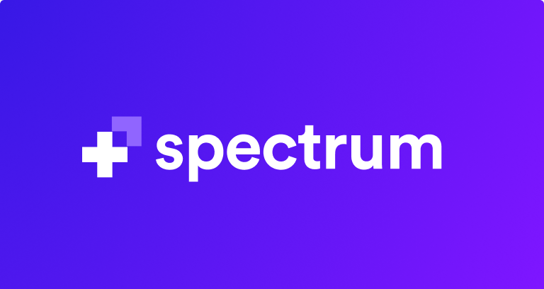

<div align="center">

[]

### Simple, powerful online communities.

</div>

This is the main monorepo codebase of [Spectrum]. Every single line of code that's not packaged into a reusable library is in this repository.

## What is Spectrum?

### Vision

It is difficult to grow, manage and measure the impact of online communities. Community owners need modern, chat-based communities but are running into scaling issues when their community grows beyond a few hundred members. It becomes hard to keep track of who's who, know what conversations are happening, and ensure that the community is staying healthy and productive.

**Spectrum aims to be the best platform to build any kind of community online by combining the best of forums and real-time chat apps.** With best-in-class moderation tooling, a single platform for all your communities, threaded conversations by default, community health monitoring, and much more to come we think that we will be able to help more people start and grow the best online communities.

> "[Spectrum] will take the place that Reddit used to have a long time ago for communities (especially tech) to freely share ideas and interact. Except realtime and trolling-free."
>

### Status


<div align="center">
  
</div>

## Docs

- [Contributing](#contributing)
  - [Ground Rules](#ground-rules)
  - [Codebase](#codebase)
    - [Technologies](#technologies)
    - [Folder Structure](#folder-structure)
    - [Code Style](#code-style)
  - [First time setup](#first-time-setup)
  - [Running the app locally](#running-the-app-locally)
  - [Roadmap](https://github.com/withspectrum/spectrum/projects/19)
- [Technical](docs/)
  - [Testing](docs/testing/intro.md)
  - [Background Jobs](docs/workers/background-jobs.md)
  - [Deployment](docs/deployments.md)
  - [API](docs/backend/api/)
    - [Fragments](docs/backend/api/fragments.md)
    - [Pagination](docs/backend/api/pagination.md)
    - [Testing](docs/backend/api/testing.md)
    - [Tips and Tricks](docs/backend/api/tips-and-tricks.md)

## Contributing

**We heartily welcome any and all contributions that match our engineering standards!**

That being said, this codebase isn't your typical open source project because it's not a library or package with a limited scope—it's our entire product.

### Ground Rules

#### Contributions and discussion guidelines

This code of conduct also applies to all conversations that happen within our contributor community here on GitHub. We expect discussions in issues and pull requests to stay positive, productive, and respectful. Remember: there are real people on the other side of that screen!

#### Reporting a bug or discussing a feature idea

If you found a technical bug on Spectrum or have ideas for features we should implement, the issue tracker is the best place to share your ideas. Make sure to follow the issue template and you should be golden! 

#### Fixing a bug or implementing a new feature

If you find a bug on Spectrum and open a PR that fixes it we'll review it as soon as possible to ensure it matches our engineering standards.

If you want to implement a new feature, open an issue first to discuss what it'd look like and to ensure it fits in our roadmap and plans for the app (see [the main project board] for planned and currently ongoing work).


Want to fix a bug or implement an agreed-upon feature? Great, jump to the [local setup instructions](#first-time-setup)!

<div align="center">
  
</div>

### Codebase

#### Technologies

With the ground rules out of the way, let's talk about the coarse architecture of this mono repo:

- **Full-stack JavaScript**: We use Node.js to power our servers, and React to power our frontend apps. Almost all of the code you'll touch in this codebase will be JavaScript.
  Here is a list of all the big technologies we use:

- **RethinkDB**: Data storage
- **Redis**: Background jobs and caching
- **GraphQL**: API, powered by the entire Apollo toolchain
- **Flowtype**: Type-safe JavaScript
- **PassportJS**: Authentication
- **React**: Frontend React app

#### Folder structure

```sh
spectrum/
├── api        # API server
├── docs
├── hyperion   # Rendering server
├── public     # Public files used on the frontend
├── shared     # Shared JavaScript code
├── src        # Frontend SPA
```

<details>
  <summary>Click to learn about the worker naming scheme</summary>

#### Naming Scheme

As you can see we follow a loose naming scheme based on ancient Greek, Roman, and philosophical figures that are somewhat related to what our servers do:

</details>

#### Code Style

We run Prettier on-commit, which means you can write code in whatever style you want and it will be automatically formatted according to the common style when you run `git commit`. We also have ESLint set up, although we've disabled all stylistic rules since Prettier takes care of those.

##### Rules

- **All new `.js` files must be flow typed**: Since we only introduced Flowtype after we finished building the first version of Spectrum, we enforce in CI that all new files added to the codebase are typed. (if you've never used Flowtype before that's totally fine, just write your code in plain JS and let us know in the PR body, we can take care of it for you)
- **No `console.log`s in any file**: We use the `debug` module across the codebase to log debugging information in development only. Never commit a file that contains a `console.log` as CI will fail your build. The only exceptions are errors, which you can log, but you have to use `console.error` to be explicit about it

<div align="center">
  
</div>

### First time setup

The first step to running Spectrum locally is downloading the code by cloning the repository:

```sh
git clone <repo url>
```


#### Installation

Spectrum has four big installation steps:

1. **Install RethinkDB**: See [the RethinkDB documentation](https://rethinkdb.com/docs/install/) for instructions on installing it with your OS.
2. **Install Redis**: See [the Redis documentation](https://redis.io/download) for instructions on installing it with your OS.
3. **Install yarn**: We use [yarn](https://yarnpkg.com) to handle our JavaScript dependencies. (plain `npm` doesn't work due to our monorepo setup) See [the yarn documentation](https://yarnpkg.com/en/docs/install) for instructions on installing it.
4. **Install the dependencies**: Because it's pretty tedious to install the dependencies for each worker individually we've created a script that goes through and runs `yarn install` for every worker for you: (this takes a couple minutes, so dive into the [technical docs](./docs) in the meantime)

```sh
node shared/install-dependencies.js
```

You've now finished installing everything! Let's migrate the database and you'll be ready to go :100:

#### Migrating the database

When you first download the code and want to run it locally you have to migrate the database and seed it with test data. First, start rethinkdb in its own terminal tab:

```sh
rethinkdb
```

Then, in a new tab, run these commands:

```sh
yarn run db:migrate
yarn run db:seed
# ⚠️ To empty the database (e.g. if there's faulty data) run yarn run db:drop
```

There's a shortcut for dropping, migrating and seeding the database too:

```sh
yarn run db:reset
```

The `testing` database used in end to end tests is managed separately. It is built, migrated, and seeded when you run:

```sh
yarn run start:api:test
```

To drop the `testing` database, go to http://localhost:8080/#tables while `rethinkdb` is running, and click Delete Database on the appropriate database.

#### Getting the secrets

While the app will run without any secrets set up, you won't be able to sign in locally. To get that set up, copy the provided example secrets file to the real location:

```
cp now-secrets.example.json now-secrets.json
```

> Note: If you're an employee at Spectrum we've got a more complete list of secrets that also lets you upload images etc. in 1Password, search for "now-secrets.json" to find it.

Now you're ready to run the app locally and sign into your local instance!

### Running the app locally

#### Background services

Whenever you want to run Spectrum locally you have to have RethinkDB and Redis running in the background. First start rethinkdb like we did to migrate the database:

```sh
rethinkdb
```

Then (without closing the rethinkdb tab!) open another tab and start Redis:

```sh
redis-server
```

#### Start the servers

Depending on what you're trying to work on you'll need to start different servers. Generally, all servers run in development mode by doing `yarn run dev:<workername>`, e.g. `yarn run dev:hermes` to start the email worker.

No matter what you're trying to do though, you'll want to have the API running, so start that in a background tab:

```
yarn run dev:api
```

#### Develop the web UI

To develop the frontend and web UI run

```
yarn run dev:web
```

<br />	
<div align="center">	
  	
</div>

